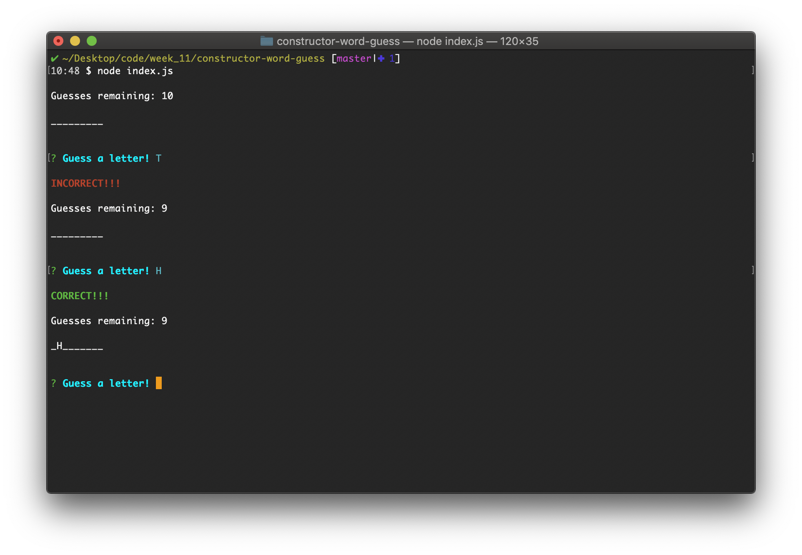

# constructor-word-guess

Node.js CLI app that lets the user play a hangman game with a Star Wars theme.

**Features include:**
* Random word choice
* Guesses remaining
* Utilizes Inquirer (NPM Package) prompts to control user input and prevent errors

### Examples
